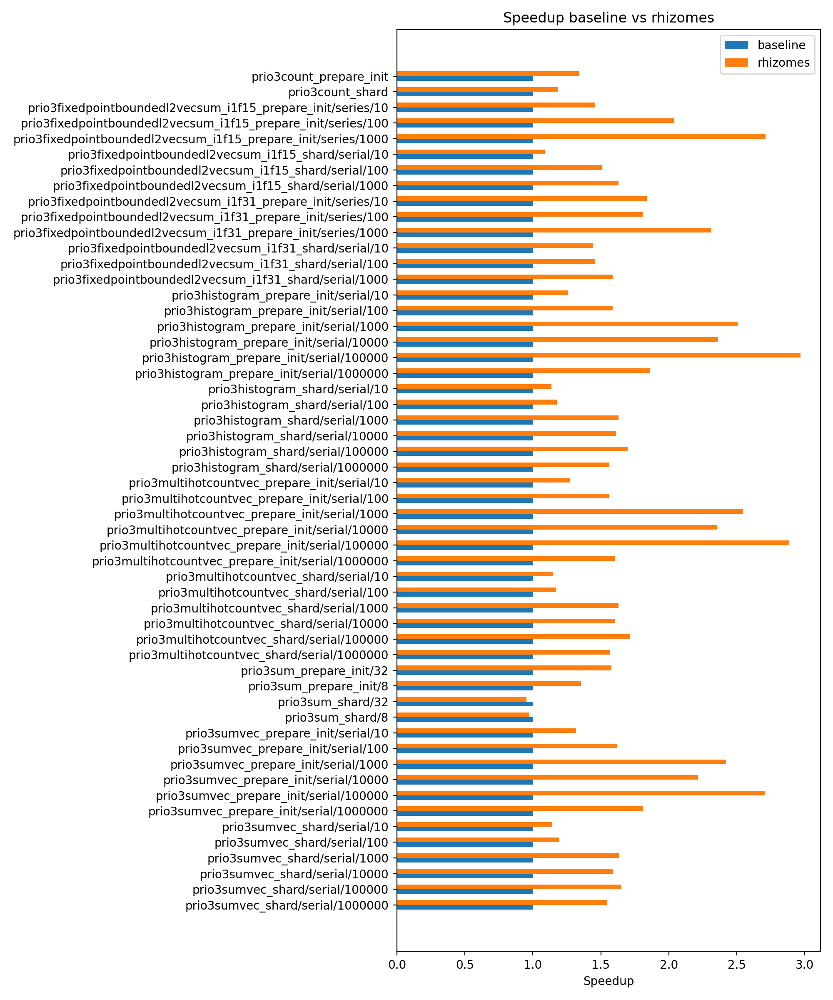

# Rhizomes and the Roots of Efficiency — Improving Prio

This repository contains supplemental material of the article titled
_"Rhizomes and the Roots of Efficiency—Improving Prio"_
published at Progress in Cryptology — LATINCRYPT 2025.

This project is a fork of [divviup/libprio-rs](https://github.com/divviup/libprio-rs), a rust implementation of Prio.

**Improvements**

- Speeds up Polynomial Evaluation in the Lagrange basis.
- Polynomials Basis Extension in the Lagrange basis.
- Use of the Pólya polynomial basis.
- Reduces the number of NTTs.

|[Branches](#branches)|[Cite](#citation)|
|--|--|

**Download the Source Code**
[verifier.zip](https://github.com/armfazh/rhizomes/archive/refs/heads/rhizomes/verifier.zip) or
[full.zip](https://github.com/armfazh/rhizomes/archive/refs/heads/rhizomes/full.zip)

## Branches

- [main](https://github.com/armfazh/rhizomes/tree/main): It follows the main branch of [divviup/libprio-rs](https://github.com/divviup/libprio-rs).
- [baseline](https://github.com/armfazh/rhizomes/tree/baseline): This is libprio-rs version [0.18.1-alpha.2](https://github.com/divviup/libprio-rs/tree/0.18.1-alpha.2) used to make comparisons.
- [rhizomes/verifier](https://github.com/armfazh/rhizomes/tree/rhizomes/verifier): Code changes to improve Prio PrepInit verification only.
- [rhizomes/full](https://github.com/armfazh/rhizomes/tree/rhizomes/full): Code changes to improve Prio both prover and verification.

## Improving Prio: PrepInit Verifier

Clone and benchmark the code using the following commands:

```sh
make clone_verifier
make bench_verifier
make graph_verifier
```


## Improving Prio: Both Prover and Verifier

Clone and benchmark the code using the following commands:

```sh
make clone_full
make bench_full
make graph_full
```



## Citation

DOI: [10.1007/978-3-032-06754-8_16](https://doi.org/10.1007/978-3-032-06754-8_16)

ePrint: [ia.cr/2025/1XXX](https://ia.cr/2025/1xxx)

```bibtex
@inproceedings{rhizomes,
  doi = {10.1007/978-3-032-06754-8_16},
  title = {{Rhizomes and the Roots of Efficiency—Improving Prio}},
  author = {Armando {Faz-Hernandez}},
  booktitle = {{Progress in Cryptology — LATINCRYPT 2025}},
  pages = {1-26},
  publisher = {Springer},
  series = {Lecture Notes in Computer Science},
  year = {2025},
}
```

## License

License is [MPL-2.0](./LICENSE.txt).
